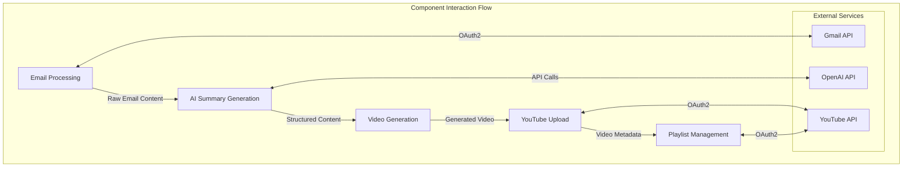

# Component Interaction Flow

## Component Descriptions

1. **Email Processing**
   - Fetches emails from Gmail
   - Parses email content
   - Extracts relevant information
   - Handles email attachments

2. **AI Summary Generation**
   - Processes email content
   - Generates summaries using AI
   - Creates structured content
   - Produces video scripts

3. **Video Generation**
   - Converts text to video
   - Generates thumbnails
   - Handles video formatting
   - Manages video assets

4. **YouTube Upload**
   - Handles video upload
   - Manages metadata
   - Processes thumbnails
   - Handles upload errors

5. **Playlist Management**
   - Creates playlists
   - Adds videos to playlists
   - Manages playlist metadata
   - Handles playlist updates

## External Services

1. **Gmail API**
   - Email access
   - OAuth2 authentication
   - Email management

2. **OpenAI API**
   - AI processing
   - Text generation
   - Content summarization

3. **YouTube API**
   - Video management
   - Playlist operations
   - Channel management 