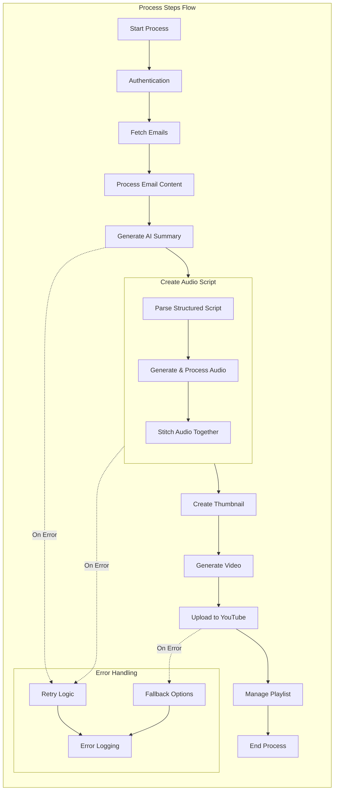

# Process Steps Flow

## Process Steps Description

1. **Start Process**
   - Initialize system
   - Load configurations
   - Setup logging

2. **Authentication**
   - Validate credentials
   - Setup OAuth tokens
   - Initialize API clients

3. **Fetch Emails**
   - Connect to Gmail
   - Retrieve unread emails
   - Filter relevant content

4. **Process Email Content**
   - Parse email structure
   - Extract text content
   - Handle attachments
   - Format content

5. **Generate AI Summary**
   - Process text with AI
   - Generate summary
   - Create initial script
   - Format description

6. **Create Audio Script**
   - **Parse Structured Script**
     - Break down AI summary into sections
     - Identify key points and transitions
     - Format for audio generation
     - Add timing markers
   
   - **Generate & Process Audio**
     - Convert sections to audio
     - Apply text-to-speech
     - Normalize volume levels
     - Add pauses and emphasis
     - Optimize audio quality
   
   - **Stitch Audio Together**
     - Combine audio snippets
     - Add background music
     - Insert transition effects
     - Ensure smooth flow

7. **Create Thumbnail**
   - Generate thumbnail image
   - Add text overlay
   - Optimize image
   - Save thumbnail

8. **Generate Video**
   - Convert text to video
   - Add audio narration
   - Include thumbnail
   - Finalize video

9. **Upload to YouTube**
   - Authenticate with YouTube
   - Upload video file
   - Set metadata
   - Handle upload status

10. **Manage Playlist**
    - Create/update playlist
    - Add video to playlist
    - Update playlist metadata
    - Verify playlist status

## Error Handling

1. **Retry Logic**
   - Automatic retries
   - Exponential backoff
   - Maximum retry limits
   - Success verification

2. **Fallback Options**
   - Alternative processing
   - Backup methods
   - Graceful degradation
   - Error recovery

3. **Error Logging**
   - Detailed error tracking
   - Performance monitoring
   - System health checks
   - Audit trail 