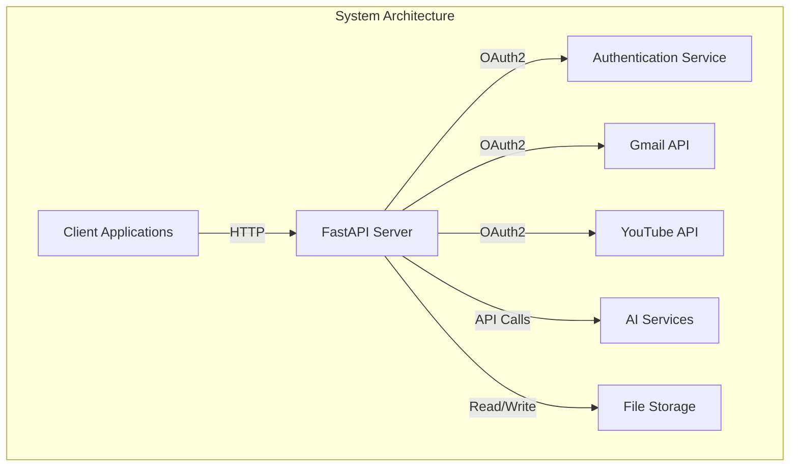

# System Architecture

## Components Description

1. **Client Applications**
   - Web clients
   - API consumers
   - Command-line tools

2. **FastAPI Server**
   - Main application server
   - REST API endpoints
   - Background task processing
   - Request handling

3. **Authentication Service**
   - JWT-based authentication
   - Supabase integration
   - User management
   - Session handling

4. **Gmail API**
   - Email fetching
   - OAuth2 integration
   - Email processing

5. **YouTube API**
   - Video upload
   - Playlist management
   - OAuth2 integration

6. **AI Services**
   - OpenAI integration
   - Text processing
   - Summary generation
   - Video generation

7. **File Storage**
   - Temporary file management
   - Video storage
   - Thumbnail storage 